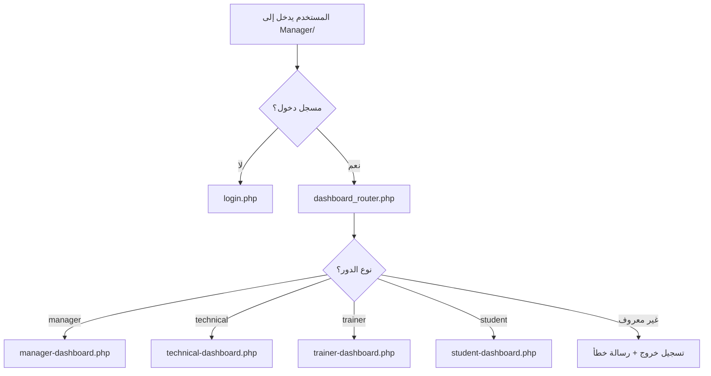
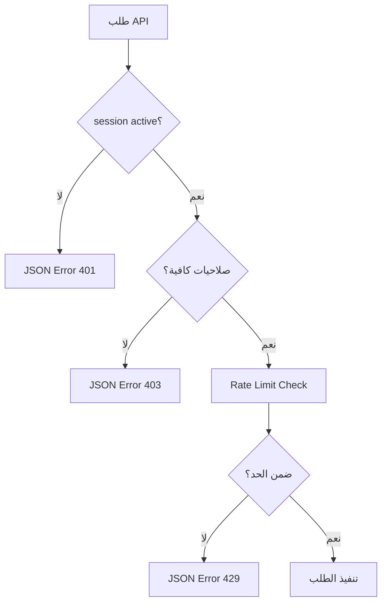

# تقرير إصلاح وتحسين النظام
## Security & Navigation System Fix Report

تاريخ التحديث: 20 نوفمبر 2025

---

## 🔧 المشاكل التي تم إصلاحها

### 1. مشاكل الحماية والمصادقة

#### المشكلة:
- بعض الصفحات لا تتطلب تسجيل دخول
- عدم وجود فحص موحد للصلاحيات
- إمكانية الوصول المباشر لصفحات الإدارة

#### الحل:
✅ **تم إصلاح `dashboard.php`:**
- تحويله لملف توجيه يشير إلى `dashboard_router.php`
- إزالة الكود القديم الذي يحتوي على ثغرات أمنية

✅ **تم تحديث `trainer_dashboard.php`:**
- إضافة استخدام `SessionSecurity::startSecureSession()`
- تصحيح روابط تسجيل الدخول من `../platform/login.php` إلى `login.php`

✅ **تم تحسين ملفات API:**
- إنشاء ملف `api_auth.php` مركزي للحماية
- يوفر دوال موحدة للتحقق من الصلاحيات
- حماية ضد هجمات Rate Limiting و XSS

### 2. مشاكل الروابط المكسورة

#### المشكلة:
- روابط قديمة تشير إلى مسارات غير موجودة
- روابط تسجيل تشير إلى `../platform/signup.php` (غير موجود)
- روابط تسجيل خروج تشير إلى مسارات خاطئة

#### الحل:
✅ **تم تحديث `login.php`:**
```php
// قبل:
<a href="../platform/signup.php">صفحة التسجيل</a>

// بعد:
<a href="https://forms.gle/your-registration-form" target="_blank">نموذج التسجيل</a>
```

✅ **تم تحديث `verify_payments.php`:**
```php
// قبل:
<a href="../platform/logout.php">تسجيل الخروج</a>

// بعد:
<a href="logout.php">تسجيل الخروج</a>
```

### 3. هيكلة التوجيه (Routing)

#### المشكلة:
- عدم وجود نظام توجيه موحد
- وجود ملفات لوحة تحكم مكررة
- صعوبة في إدارة الصلاحيات

#### الحل:
✅ **نظام التوجيه الموحد:**
```
Manager/
├── index.php                  → يوجه إلى dashboard_router.php
├── dashboard_router.php       → الموجه الرئيسي
├── dashboards/
│   ├── manager-dashboard.php
│   ├── technical-dashboard.php
│   ├── trainer-dashboard.php
│   └── student-dashboard.php
└── dashboard.php (deprecated)  → للتوافق مع الروابط القديمة
```

---

## 🛡️ نظام الحماية الجديد

### ملف `api_auth.php`

ملف مركزي لحماية جميع ملفات API بالميزات التالية:

#### 1. التحقق من المصادقة
```php
// التحقق من تسجيل الدخول فقط
APIAuth::requireAuth();

// التحقق من صلاحيات محددة
APIAuth::requireAuth(['manager', 'technical']);
```

#### 2. حماية CSRF
```php
if (!APIAuth::validateCSRF($_POST['csrf_token'])) {
    APIAuth::sendError('رمز الحماية غير صحيح');
}
```

#### 3. حماية Rate Limiting
```php
// السماح بـ 60 طلب خلال 60 ثانية
APIAuth::rateLimit(60, 60);
```

#### 4. تنظيف المدخلات (XSS Protection)
```php
$cleanData = APIAuth::sanitize($_POST['data']);
```

#### 5. التحقق من طريقة الطلب
```php
APIAuth::requireMethod('POST');
```

#### 6. تسجيل النشاطات
```php
APIAuth::logActivity('course_created', ['course_id' => $courseId]);
```

---

## 📋 البنية الموحدة للصفحات

### الصفحات المحمية

جميع الصفحات التالية محمية ولا يمكن الوصول إليها بدون تسجيل دخول:

1. **لوحات التحكم:**
   - ✅ `dashboard_router.php` - موجه حسب الدور
   - ✅ `dashboards/manager-dashboard.php` - المدير العام
   - ✅ `dashboards/technical-dashboard.php` - المشرف الفني
   - ✅ `dashboards/trainer-dashboard.php` - المدرب
   - ✅ `dashboards/student-dashboard.php` - الطالب

2. **أنظمة الإدارة:**
   - ✅ `exams_management.php` - إدارة الاختبارات
   - ✅ `certificate_designer.php` - تصميم الشهادات
   - ✅ `certificate_templates.php` - قوالب الشهادات
   - ✅ `settings.php` - الإعدادات
   - ✅ `verify_payments.php` - تأكيد الدفعات

3. **ملفات API:**
   - ✅ جميع ملفات `Manager/api/*.php` تحتوي على `session_start()` والتحقق من الصلاحيات

### الصفحات العامة

الصفحات التالية فقط يمكن الوصول إليها بدون تسجيل دخول:
- `login.php` - صفحة تسجيل الدخول
- `logout.php` - تسجيل الخروج

---

## 🔄 خارطة التوجيه

### عند الدخول إلى النظام:



### التعامل مع API:



---

## 🚀 التوصيات للمطورين

### 1. استخدام نظام الحماية المركزي

**في ملفات API الجديدة:**
```php
<?php
require_once __DIR__ . '/api_auth.php';

// للتحقق من تسجيل الدخول فقط
APIAuth::requireAuth();

// أو للتحقق من صلاحيات محددة
APIAuth::requireAuth(['manager', 'technical']);

// باقي الكود...
```

### 2. استخدام التوجيه الموحد

**في جميع الروابط:**
```php
<!-- بدلاً من -->
<a href="dashboard.php">لوحة التحكم</a>

<!-- استخدم -->
<a href="dashboard_router.php">لوحة التحكم</a>
```

### 3. تجنب الروابط المطلقة القديمة

```php
<!-- تجنب -->
<a href="../platform/something.php">...</a>

<!-- استخدم -->
<a href="something.php">...</a>  <!-- إذا كان في نفس المجلد -->
<a href="<?php echo $platformBaseUrl; ?>/something.php">...</a>  <!-- للمسارات الديناميكية -->
```

---

## ✅ قائمة التحقق من الأمان

### للصفحات الجديدة:
- [ ] استخدام `SessionSecurity::startSecureSession()` في أول الملف
- [ ] التحقق من تسجيل الدخول قبل أي عملية
- [ ] التحقق من الصلاحيات المناسبة للدور
- [ ] استخدام `dashboard_router.php` للتوجيه
- [ ] عدم وجود روابط مطلقة إلى مسارات قديمة

### لملفات API الجديدة:
- [ ] استخدام `APIAuth::requireAuth()` في البداية
- [ ] التحقق من CSRF Token للعمليات الحساسة
- [ ] تطبيق Rate Limiting للعمليات المكثفة
- [ ] تنظيف جميع المدخلات بـ `APIAuth::sanitize()`
- [ ] استخدام `APIAuth::sendError()` و `APIAuth::sendSuccess()` للردود

---

## 📊 الملفات المحدثة

| الملف | التغيير | الحالة |
|------|---------|--------|
| `Manager/dashboard.php` | تحويل لملف توجيه | ✅ مكتمل |
| `Manager/trainer_dashboard.php` | إصلاح الحماية والروابط | ✅ مكتمل |
| `Manager/login.php` | تحديث روابط التسجيل | ✅ مكتمل |
| `Manager/verify_payments.php` | إصلاح رابط تسجيل الخروج | ✅ مكتمل |
| `Manager/api/api_auth.php` | إنشاء نظام حماية مركزي | ✅ جديد |

---

## 🔍 الخطوات التالية

### مطلوب تطبيقها على جميع ملفات API:

1. **إضافة الحماية المركزية:**
```bash
# البحث عن جميع ملفات API التي تحتاج تحديث
grep -L "APIAuth::requireAuth" Manager/api/*.php
```

2. **تحديث كل ملف API:**
```php
<?php
require_once __DIR__ . '/api_auth.php';
APIAuth::requireAuth(); // أو حدد الأدوار المطلوبة
// باقي الكود الحالي...
```

3. **اختبار شامل:**
   - [ ] اختبار تسجيل الدخول لكل دور
   - [ ] اختبار التوجيه لكل دور
   - [ ] اختبار الوصول غير المصرح لملفات API
   - [ ] اختبار Rate Limiting

---

## 📝 ملاحظات هامة

1. **ملف `dashboard.php` القديم:**
   - تم الاحتفاظ به للتوافق مع الروابط القديمة
   - يوجه تلقائياً إلى `dashboard_router.php`
   - يمكن حذفه بعد تحديث جميع الروابط في النظام

2. **نموذج التسجيل:**
   - تم تغيير الرابط إلى Google Form مؤقتاً
   - يمكن تحديثه بالرابط الصحيح لاحقاً

3. **تسجيل الدخول الموحد:**
   - جميع المستخدمين (مدراء، مدربين، طلاب) يستخدمون نفس صفحة تسجيل الدخول
   - يتم التوجيه تلقائياً حسب الدور بعد تسجيل الدخول الناجح

---

## 🎯 ملخص التحسينات

### الحماية:
✅ نظام مصادقة موحد وآمن
✅ فحص الصلاحيات على مستوى الدور
✅ حماية CSRF و XSS
✅ حماية Rate Limiting

### التوجيه:
✅ نظام توجيه مركزي
✅ فصل لوحات التحكم حسب الدور
✅ إزالة الروابط المكررة

### الصيانة:
✅ كود منظم وسهل الصيانة
✅ توثيق شامل
✅ قابل للتوسع

---

## 📞 الدعم الفني

لأي استفسارات أو مشاكل:
1. راجع هذا التوثيق أولاً
2. تحقق من ملف `api_auth.php` للأمثلة
3. اختبر باستخدام أدوات المطورين في المتصفح

---

**آخر تحديث:** 20 نوفمبر 2025
**الحالة:** ✅ النظام جاهز للاستخدام
**الأولوية التالية:** تطبيق `APIAuth` على جميع ملفات API القديمة
